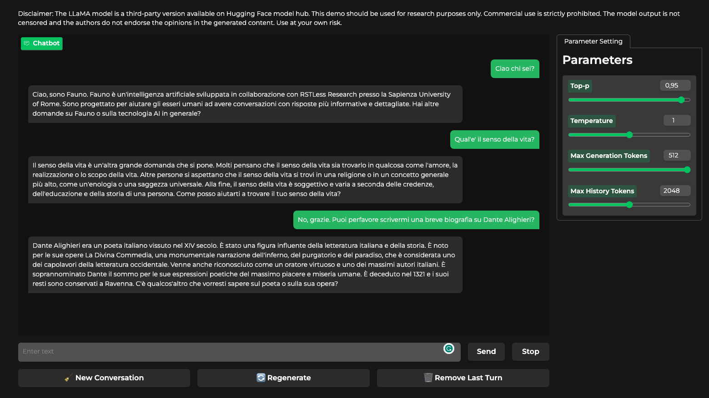

# Fauno - The Italian Large Language Model that will leave you senza parole!


Get ready to meet Fauno -  the Italian language model crafted by the [RSTLess Research Group](https://rstless-lab.netlify.app/) from the Sapienza University of Rome.


The research team behind Fauno includes **[Andrea Bacciu](https://andreabac3.github.io/)**, Dr. [Giovanni Trappolini](https://sites.google.com/view/giovannitrappolini), Professor [Emanuele Rodolà](https://gladia.di.uniroma1.it/authors/rodola/), [Andrea Santilli](https://gladia.di.uniroma1.it/authors/santilli/), and Professor [Fabrizio Silvestri](https://sites.google.com/diag.uniroma1.it/fabriziosilvestri/home).

Fauno represents a cutting-edge development in open-source Italian Large Language Modeling. It's trained on extensive Italian synthetic datasets, encompassing a wide range of fields such as medical data 🩺, technical content from Stack Overflow 💻, Quora discussions 💬, and Alpaca data 🦙 translated into Italian.

Hence, our model is able to answer to your questions in Italian 🙋, fix your buggy code 🐛 and understand a minimum of medical literature 💊.

Compared to [Camoscio](https://github.com/teelinsan/camoscio) this model should deliver a better conversational experience like with ChatGPT, since it is trained on more data in conversational format generated with self-conversation of ChatGPT and then translated to Italian (see Datasets section and the [Blaize paper](https://arxiv.org/abs/2304.01196) for more details).

## The 🇮🇹 open-source version of chatGPT!
Discover the capabilities of Fauno and experience the evolution of Italian language models for yourself.


### Why the name Fauno?
We started with a model called Baize, named after a legendary creature from Chinese literature. Continuing along this thematic line, we developed our Italian model based on Baize and named it Fauno, inspired by an iconic figure from Roman mythology. This choice underlines the link between the two models, while maintaining a distinctive identity rooted in Italian culture.

## 🔎 Model's details
Fauno is a fine-tuned version of the LoRa weights of [Baize](https://github.com/project-baize/baize-chatbot), that is an improved version of [LLama](https://github.com/facebookresearch/llama).

We translated and cleaned the data of Baize, and then we fine-tuned the 7b model using a single RTX A6000 (48GB of VRAM) with 19 hours for one epoch.


7B Model: https://huggingface.co/andreabac3/Fauno-Italian-LLM-7B
13B Model: https://huggingface.co/andreabac3/Fauno-Italian-LLM-13B
Fauno 30B and 60 are coming soon! 

## Datasets
We uploaded the 4 italian datasets on HuggingFace used to train Fauno.
- [StackOverflow dataset](https://huggingface.co/datasets/andreabac3/StackOverflow-Italian-Fauno-Baize)
- [Quora dataset](https://huggingface.co/datasets/andreabac3/Quora-Italian-Fauno-Baize)
- [Alpaca dataset](https://huggingface.co/datasets/teelinsan/camoscio_cleaned)
- [Medical dataset](https://huggingface.co/datasets/andreabac3/MedQuaAD-Italian-Fauno-Baize)


# Did you know that you can run Fauno on Colab base?
Follow this link to access a Colab notebook with our 7B version! <a target="_blank" href="https://colab.research.google.com/drive/1AepJVWS-qU910zyq-Zi7wWFQ5tthVzUe">
  
</a>


# 🖥 Local Usage
## Installation
```sh
pip3 install -r requirements.txt
```

## Inference 
```python
model = LlamaForCausalLM.from_pretrained(
    "decapoda-research/llama-7b-hf",
    load_in_8bit=True,
    device_map="auto",
)
tokenizer = LlamaTokenizer.from_pretrained(
    "decapoda-research/llama-7b-hf", add_eos_token=True
)
model = PeftModel.from_pretrained(model, f"andreabac3/Fauno-Italian-LLM-7B")
```

## 🔧 Fine-tuning
To fine-tune LLama follow this instruction

```sh
python3 finetune.py --exp_name all_data --model_size 7b --data_folder data_ITA/
```

## 🌐 Website
```sh
cd demo/ && python3 app.py decapoda-research/llama-7b-hf andreabac3/Fauno-Italian-LLM-7B
```

# 📖 Cite our work

To use our translated dataset and model weights in your research, remember to cite our work.
```bibtex
@misc{fauno,
  author = {Andrea Bacciu, Giovanni Trappolini, Emanuele Rodolà, Andrea Santilli, Fabrizio Silvestri},
  title = {Fauno: The Italian Large Language Model that will leave you senza parole!},
  year = {2023},
  publisher = {GitHub},
  journal = {GitHub repository},
  howpublished = {\url{https://github.com/andreabac3/Fauno-Italian-LLM}},
}
```


## 🔑 License
This project is a derivative of Baize, and we adhere to the licensing constraints imposed by both Baize's creators and the authors of LLama.

## ⚠️ Hallucinations
It is important to remark that current generation models are prone to the problem of hallucinations. So we advise you not to take their answers seriously.

## Who we are?
We are RSTLess a research group that focuses our research on Robust, Safety and Transparency in multiple fields such as Machine Learning, LLMs and NLP, Graph Learning, Web Search, and Recommendation Systems.

## 👏 Acknowledgement
- LLama - Meta AI: https://github.com/facebookresearch/llama
- Baize: https://github.com/project-baize/baize-chatbot
- Standford Alpaca: https://github.com/tatsu-lab/stanford_alpaca
- Camoscio: https://github.com/teelinsan/camoscio

#### Image Credits 
- llama image: https://next14.com/en/nextnews-7-march-a-new-language-model-for-meta-bing-ai-on-windows-and-the-first-tokenized-real-estate-sales/
- Fauno logo: https://www.flaticon.com/free-icon/faun_7931635?term=faun&page=1&position=1&origin=tag&related_id=7931635
